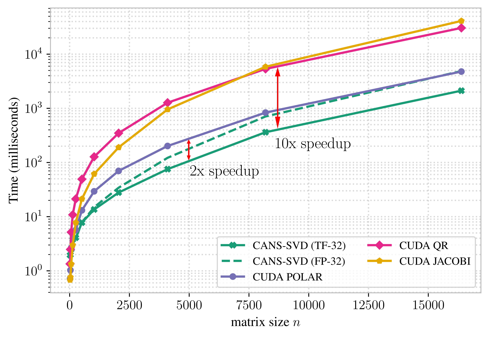

# Faster SVD via Accelerated Newton-Schulz Iteration

<p align="center">
<a href="https://colab.research.google.com/github/fallnlove/polar-svd/blob/main/demo.ipynb" target="_parent"></a>
<a href="https://iclr.cc/virtual/2026/poster/10012135" target="_parent"></a>
<a href="https://iclr-blogposts.github.io/2026/blog/2026/polar-svd/" target="_parent"></a>
</p>

> Traditional SVD algorithms rely heavily on QR factorizations, which scale poorly on GPUs. We show how the recently proposed Chebyshev-Accelerated Newton-Schulz (CANS) iteration can replace them and produce an SVD routine that is faster across a range of matrix types and precisions.



This repository is the official implementation of our ICLR 2026 blogpost "Faster SVD via Accelerated Newton-Schulz Iteration" by Askar Tsyganov*, Uliana Parkina*, Ekaterina Grishina, Sergey Samsonov, and Maxim Rakhuba.

## Setup

1. Clone the repository and enter the project directory:

```bash
git clone https://github.com/fallnlove/polar-svd.git
cd polar-svd
```

2. Install dependencies:

- CPU (macOS/Linux/Windows):

```bash
pip install jax numpy
```

- NVIDIA GPU (CUDA):

```bash
pip install -r requirements.txt
```

Note: `requirements.txt` currently targets a CUDA-enabled JAX build.

## Usage Example

```python
import jax
import jax.numpy as jnp

from src import cans_svd

key = jax.random.PRNGKey(0)
A = jax.random.normal(key, (1024, 1024), dtype=jnp.float32)

U, s, Vt = cans_svd(A)

A_hat = (U * s) @ Vt
rel_err = jnp.linalg.norm(A - A_hat) / jnp.linalg.norm(A)
u_orth = jnp.linalg.norm(U.T @ U - jnp.eye(U.shape[1]))
v_orth = jnp.linalg.norm(Vt @ Vt.T - jnp.eye(Vt.shape[0]))

print("relative reconstruction error:", rel_err)
print("||U^T U - I||:", u_orth)
print("||V V^T - I||:", v_orth)
```

## Citation

```bibtex
@inproceedings{tsyganov2026faster,
  author = {Tsyganov, Askar and Parkina, Uliana and Grishina, Ekaterina and Samsonov, Sergey and Rakhuba, Maxim},
  title = {Faster SVD via Accelerated Newton-Schulz Iteration},
  booktitle = {ICLR Blogposts 2026},
  year = {2026},
  date = {April 27, 2026},
  note = {https://iclr-blogposts.github.io/2026/blog/2026/polar-svd/},
  url  = {https://iclr-blogposts.github.io/2026/blog/2026/polar-svd/}
}
```
